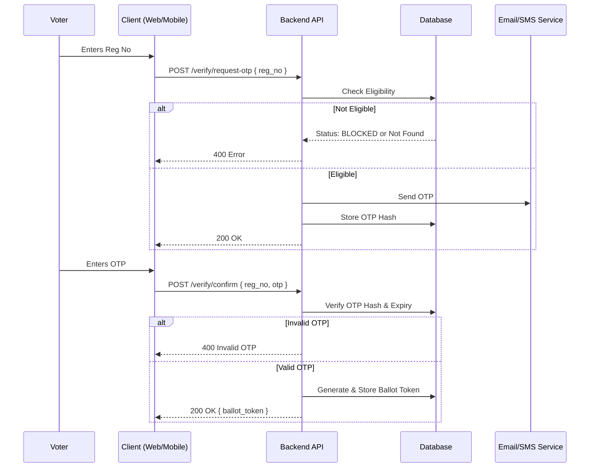
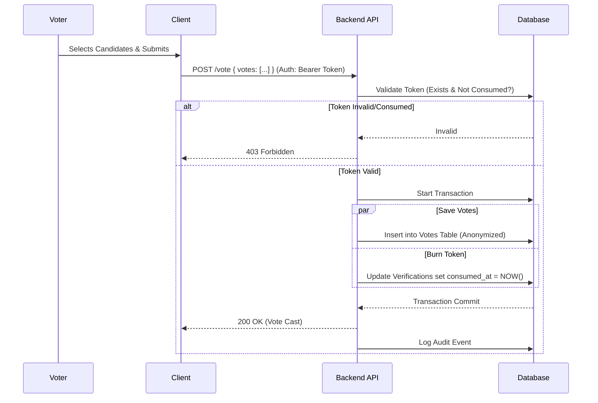

# API Level Flow Charts

## 1. Voter Verification Flow

```mermaid
sequenceDiagram
    participant V as Voter
    participant C as Client (Web/Mobile)
    participant API as Backend API
    participant DB as Database
    participant E as Email/SMS Service

    V->>C: Enters Reg No
    C->>API: POST /verify/request-otp { reg_no }
    API->>DB: Check Eligibility
    alt Not Eligible
        DB-->>API: Status: BLOCKED or Not Found
        API-->>C: 400 Error
    else Eligible
        API->>E: Send OTP
        API->>DB: Store OTP Hash
        API-->>C: 200 OK
    end

    V->>C: Enters OTP
    C->>API: POST /verify/confirm { reg_no, otp }
    API->>DB: Verify OTP Hash & Expiry
    alt Invalid OTP
        API-->>C: 400 Invalid OTP
    else Valid OTP
        API->>DB: Generate & Store Ballot Token
        API-->>C: 200 OK { ballot_token }
    end
```

## 2. Voting Flow

```mermaid
sequenceDiagram
    participant V as Voter
    participant C as Client
    participant API as Backend API
    participant DB as Database

    V->>C: Selects Candidates & Submits
    C->>API: POST /vote { votes: [...] } (Auth: Bearer Token)
    API->>DB: Validate Token (Exists & Not Consumed?)
    alt Token Invalid/Consumed
        DB-->>API: Invalid
        API-->>C: 403 Forbidden
    else Token Valid
        API->>DB: Start Transaction
        par Save Votes
            API->>DB: Insert into Votes Table (Anonymized)
        and Burn Token
            API->>DB: Update Verifications set consumed_at = NOW()
        end
        DB-->>API: Transaction Commit
        API-->>C: 200 OK (Vote Cast)
        API->>DB: Log Audit Event
    end
```
